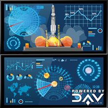

# Mission Control

Mission Control is a service running on the DAV network, and serving as a marketplace connecting DAV users looking to ship packages, with drone owners.

Mission Control demonstrates how a third party might build their own product, while integrating technologies provided by DAV, and provide a service to users connecting through a mobile app and independent drones connecting directly to Mission Control to offer their services.

### Mission Control is currently under heavy construction!

At its current state it is mostly a mock API used to develop the other pieces of the puzzle.

Feel free to **Star** and **Watch** it, but watch out for falling debris, and a wildly changing API.

Feedback and contributions are always welcome and appreciated.

### License

Licensed under [MIT](https://github.com/DAVFoundation/missioncontrol/blob/master/LICENSE).
