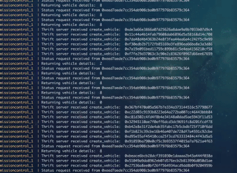

# Mission Control

Mission Control is a service running on the DAV network, and serving as a marketplace connecting DAV users, vehicles, and services.

Mission Control demonstrates how a third party might build their own product, while integrating technologies provided by DAV, and provide a service to users connecting through a mobile app and independent vehicles connecting directly to Mission Control to offer their services.

### Contributing Code, Reporting Bugs and Suggesting Features

As an organization committed to extreme transparency, collaboration, and open-sourcing all of our work, we welcome participation from anyone willing to devote some time and energy to help shape DAV - whether you are a first time contributor, a veteran open-sourcerer, or just looking to suggest some ideas.

For help in getting started, please be sure to read our [contribution guidelines](https://github.com/DAVFoundation/missioncontrol/blob/master/CONTRIBUTING.md).

